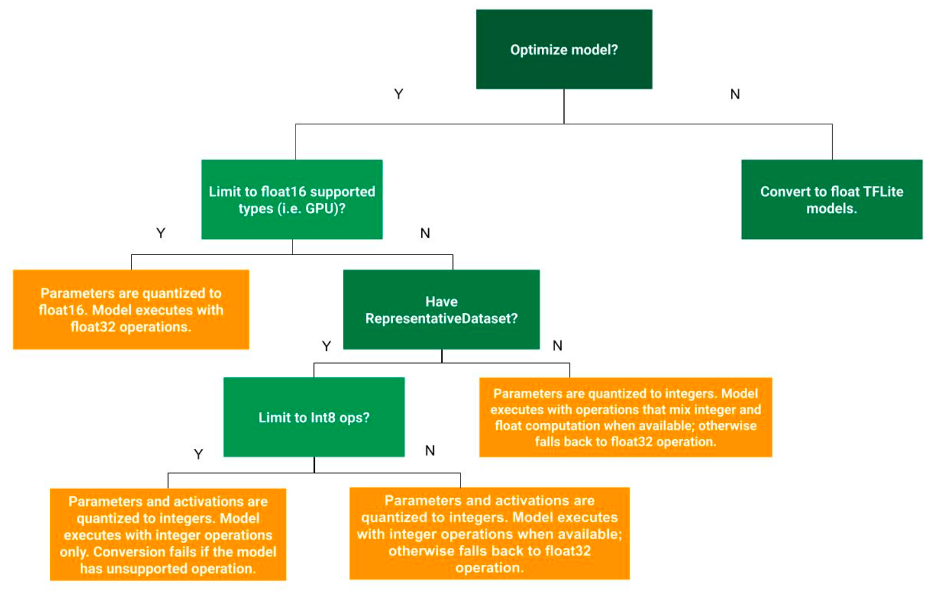

# How Quantization Mechanism Used?

This project develops an image classification model on the Arduino Nano 33 BLE Sense, focusing on optimizing the model through 8-bit quantization for deployment on resource-limited hardware. Preprocessing steps prepare real-time images from a camera sensor by resizing, normalizing, and transforming them into a 784-dimensional input vector. The model is converted to an 8-bit format using TensorFlow Lite's post-training quantization, reducing memory usage significantly. This quantization process is essential for fitting the model within the Arduino Nano’s memory constraints while retaining high classification accuracy achieving efficient and responsive image classification.
